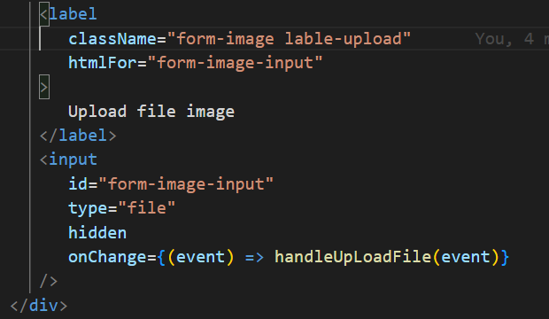
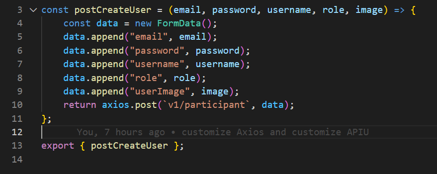
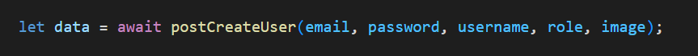

# CHAPTER 1: ÔN LẠI ES6

npm start
npm install --save-exact sass@1.53.0

## Bài 5: Map,Filter

-   JSX: là một cú pháp trong RJS dùng để viết html vào JS

## Bài 10 Spread:

-   Khi sử dụng để nối 2 object thì obj2 sẽ ghi đè thuộc tính trùng của obj1

*   VD: {...obj1, ...obj2}

## Bài 13: Otional chaining ?.

-   ?. sẽ kiểm tra xem biến bên trái nó có tồn tại hay không để thực hiện bên phải
-   ?. không thể dùng để gán giá trị

*   VD:
    let user = null
    user?.name = "PT26" // Error
    (undefined = string) // Điều này không thể xảy ra

# CHAPTER 2: REACT JS

## Bài 17: Hello World with React JS

-   Hot reloading: ứng dụng được cập nhật realtime, không phải load lại trang
-   Babel compiler: đã được tích hợp sẳn, công dụng giúp code JS với mọi versions
-   Webpack: dùng để nén code, tối ưu hiệu năng

## Bài 19: Cách hoạt động của React JS

-   SPA (single page application)
-   Sử dụng super index để render tất cả mọi thứ, bao gồm các component được react xử lý sao đó render sang index.html trong phần public
-   Không phải load lại trang với react

## Bài 20: React Component

-   Cách viết cũ: class component
-   Cách viết mới: function component
-   Trong component chỉ trả về duy nhất 1 thẻ

## Bài 21: State - Kiểm soát data

-   Là dữ liệu để xử lý logic trong RJ

## Bài 23: DOM Events

-   https://legacy.reactjs.org/docs/events.html gần như các thao tác với event đều có trên web này

## Bài 24: Cập nhật State với setState

-   Dùng để cập nhật các giá trị trong state

*   VD: () => {this.setState({})}
*   Mẹo: Khi viết hàm onSubmit vào <form> thì đã bắt được luôn sự kiện nhấn nút enter

## Bài 26: Nesting Component

-   Lồng component vào nhau
-   Tách code dễ quản lý và sử dụng

## Bài 27: Props

-   Dùng để truyền dữ liệu từ component cha sang component con

## Bài 28: Outputting List

-   Phải đặt thêm key cho phần tử được render ra để react biết phần tử nào để xử lý

*   Tránh sử dụng index thay vào đó sử dụng key = {user.id} (id được khởi tạo trong obj user)

## Bài 29: Conditional Output

-   Logic toggle hay trong RJ:
    state = {
    isShowList: true,
    }
    handleClick = () => {
    this.setState({
    // Logic này hay cần nhớ
    isShowList: !this.state.isShowList
    })
    }

## Bài 37: Class Components

-   Component Did Mount thường dùng để call API, cập nhật state, props => giao diện cập nhật theo

## Bài 39: REACT HOOK

-   Sử dụng [state, setState] = useState(giá trị khởi tạo cho state)

*   VD: const [isShowHideListUser, setShowHideListUser] = useState(true);

## Bài 42: useEffect Hook

-   Sẽ chạy sau khi render ra dữ liệu
-   Sử dụng userEffect khi xử lý các tác vụ liên quan đến DOM
-   Thêm [] cho argument thứ 2 thì chỉ chạy 1 lần
-   Muốn theo dõi giá trị quá khứ tưởng lai của một state thì thêm vào

*   VD: [listUsers]

## Bài 49: Nested Routes

-   Các route con sẽ nằm trong route cha để chia sẽ phần dùng chung
-   Đồng thời <Outlet> sẽ là nơi mà phần con sẽ được render ra

## Bài 57: State hóa Modal Add Users

-   Sử dụng htmlFor trong lable để mapping tới input cần dùng (bằng ID)

    -   

-   Thực hiện thêm file ảnh và preview
    -   Tạo một input có type = file
    -   Xử lý bằng onChange, xây dựng handleUploadImg
    -   const handleUpLoadFile = (event) => {
        setPreviewImg(URL.createObjectURL(event.target.files[0]));
        };

## Bài 58: Creat user

-   Sử dụng axios với phương thức post
-   Để truyền dữ liệu sử dụng append("key", value)
    
-   Để sử dụng tạo event xử lý form và truyền hàm vào xử dụng
    

## Bài 61: Read User

-   B1: Xây dựng giao diện demo trước (Table)
-   B2: Fake API bằng {hardcode} vào useState
-   B3: Fetch API về sử dụng trong useEffect

## Bài 62: Cập nhật danh sách khi thêm mới

-   Từ listUser của TableUser thì chuyển lên ManageUser quản lý
-   Fetch API từ thằng cha xong truyền data xuống tk con table để render
-   Việc khi thêm mới trong modal đồng rerender table thì cần phải cho xử lý khi nhấn save
-   Khi nhấn save sẽ phải fetch API để GET lại các user nên truyền props là fetchUsers có getAllUsers

## Bài 63: Design Modal Update

-   Sử dụng lodash để check dataUpdate có rỗng không

# CÁC THƯ VIỆN ĐÃ SỬ DỤNG

-   react-bootstrap": "2.4.0",
-   react-icons": "4.4.0",
-   react-pro-sidebar": "0.7.1",
-   react-redux": "8.0.1",
-   react-router-dom": "^6.22.3",
